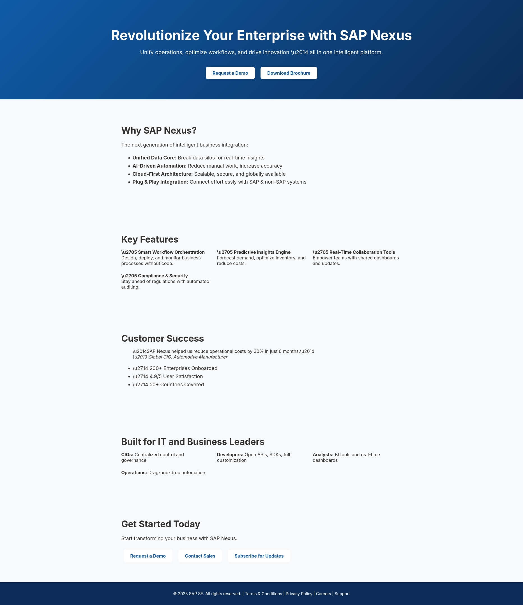

# Na początku było słowo...

... a więc trzeba zacząć od napisania jakiegokolwiek zapytania, aby mieć punkt zaczepienia.

```plaintext
Create landing page for new SAP product.
```

Już samo to zapytanie generuje nam całkiem dobrze wyglądającą stronę (łącznie z marketingowym ~bełkotem~ tekstem, którego nie powstydziłby się sam SAP).

[Podgląd wygenerowanej strony](https://chatgpt.com/canvas/shared/68543bf213a881918250f0cbf118a970)



Można jednak zdecydowanie poprawić wygląd wygenerowanej strony dając modelowi więcej informacji.