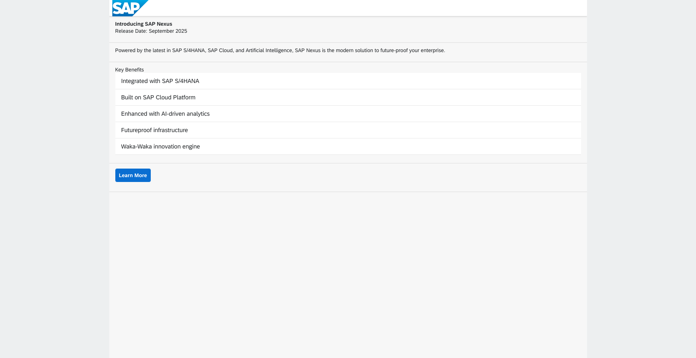
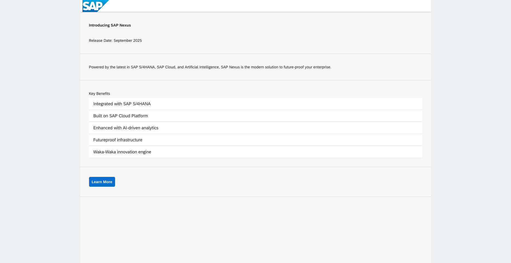
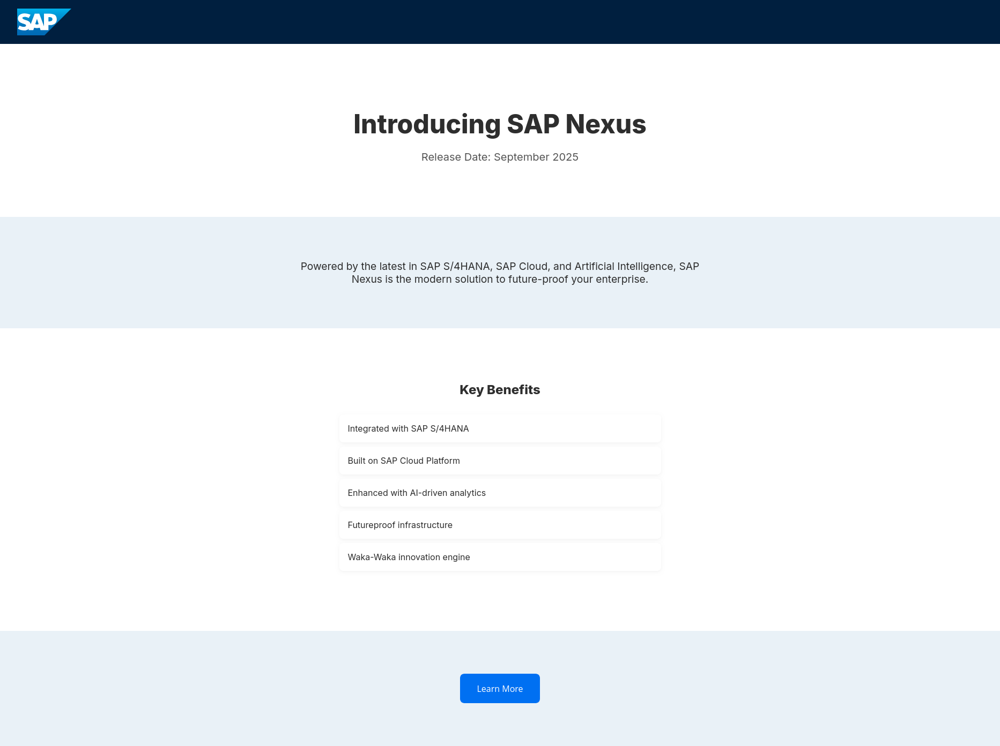

# Słyszałeś co ci powiedziałem, czy nie słyszałeś co ci powiedziałem?

### Iteracyjne tworzenie rozwiązań

W konwersacyjnych modelach językowych możemy skorzystać z funkcji, która znacznie ułatwia tworzenie rozwiązań - mam na myśli kontekst konwersacji.

Kontekst pozwala na iteracyjne ulepszanie prototypów, ponieważ nie trzeba powtarzać poprzednich instrukcji,
a dodatkowo można się odnosić do wygenerowanego rezultatu, aby np. poprawić konkretne fragmenty.

[Przykładowa konwersacja z iteracjami](https://chatgpt.com/share/68547515-6148-8003-b5c8-3ed87337a03b)

Pierwotna wersja wygenerowana dla poniższego zapytania nie wyglądała specjalnie zachęcająco:

```plaintext
Create HTML landing page for new SAP Product.
Page should use SAPUI5 design guidelines.
Header should contain SAP logo on the left.
Make every section distinct visually (eg. set different backgrounds)

Use the following info:

Product name: SAP Nexus
Release date: September 2025
Keywords: SAP S4/HANA, SAP Cloud, AI, Modern Solutions, Futureproof, Waka-Waka
```



Zdecydowanie brakuje tej stronie przestrzeni wizualnej więc dodajemy zapytanie:

```plaintext
Add more padding to elements.
```

otrzymując następujący rezultat:



Wygląda to już nieco lepiej, jednak użycie biblioteki SAPUI5 znacznie ogranicza możliwości dostosowania wyglądu, więc zrezygnujmy z jej użycia.

```plaintext
Forget about UI5, make it prettier.
```



Jak widać, na wygenerowanej stronie brakuje stópki, więc dodajmy ją dodając następujące zapytanie:

```plaintext
Add footer with SAP Logo and current year.
```


