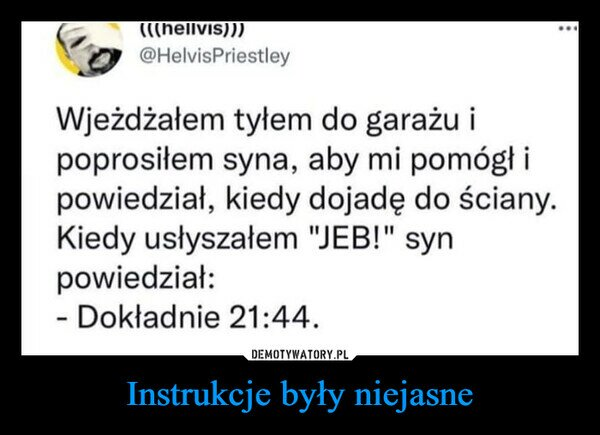

# Ciemność widzę, ciemność!

Jak zobaczyliśmy w poprzednim rozdziale niejednoznaczne zapytanie będzie prowadzić do niedokładnych, błędnych rezultatów lub ich braku.

Wróćmy więc do poprzedniego zapytania, lecz tym razem dodajmy więcej konkretów.

```
Stwórz aplikację webową wyświetlającą fikcyjne cytaty znanych osób.
```

Ponieważ odpowiedzi są dość długie - zamiast screenshotów zamieszczam linki do konwersacji:

[ChatGPT](https://chatgpt.com/s/t_685a9f1d0cf481919acfaba8f1d11bc6)

[Gemini](https://g.co/gemini/share/78ac73710178)

Odpowiedzi obydwu modeli są poprawne i zasadniczo działają tak jak powinny[^1], jednak możemy jeszcze doprecyzować nasze zapytanie np. aby używany był konkretny stos technologiczny.

```plaintext
Stwórz aplikację webową wyświetlającą fikcyjne cytaty znanych osób. Aplikacja powinna wykorzystywać framework Angular v20 i zawierać wyśrodkowany element z fikcyjnym cytatem oraz przycisk do generowania cytatu.
```

[ChatGPT](https://chatgpt.com/s/t_685bae9754cc8191958263c57319968a)

[Gemini](https://g.co/gemini/share/e7197af6c32a)

Tym razem otrzymaliśmy bardzo podobne efekty, ale pojawił się inny problem — jesteśmy początkującymi web-devami i nie zawsze wiemy jak należy uruchomić wygenerowany kod, a instrukcje były niejasne...[^2] [^3]



Może udałoby się w jakiś sposób doprecyzować nasze oczekiwania? Zobaczmy!

[^1]: W przypadku odpowiedzi wygenerowanej przez GPT, ze względu na użycie frameworka React odpowiedź wymagała lekkiego dostosowania konfiguracji użytych bibliotek i drobnej korekty poleceń CLI (używanie `@latest` nie zawsze jest najlepszym rozwiązaniem 😉).
[^2]: *Wersja SFW*, [wersja NSISFW (Not Sure If Safe For Work)](https://kwejk.pl/obrazek/2741295/instrukcje-byly-niejasne.html)
[^3]: W przypadku ChatGPT brakowało instrukcji gdzie umieścić i jak wyświetlić wygenerowany komponent; w przypadku Gemini instrukcja podmiany była błędna.
W obu przypadkach pojawiły się błędy związane ze zmianą konwencji nazewniczej plików w Angular 19.