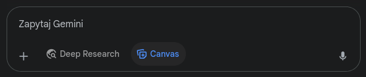
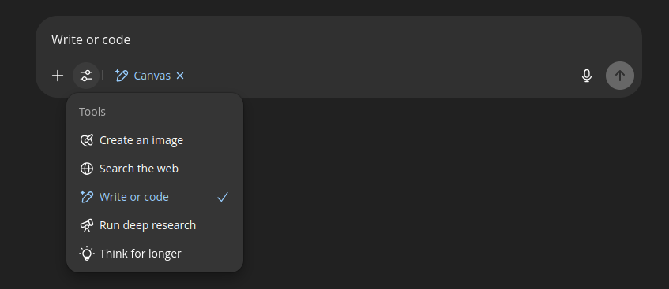

# A może by tak rzucić to wszystko i zostać sysadminem?

`terraform apply --target='Bieszczady'`

... chociaż to bardziej z dziedziny DevOps. My tymczasem zajmijmy się rolami, zadaniami i ograniczeniami i innymi pomocnymi narzędziami.

<div class="warning">
Do tej pory używałem w promptach języka polskiego, jednak nie ma co ukrywać - modele typu GPT czy Gemini są trenowane przez Amerykanów i angielski jest dla nich bardziej "naturalnym" językiem, więc od tego momentu przerzucę się na zapytania w języku angielskim. Pozwoli to na swobodniejsze i efektywniejsze porozumiewanie się z LLM.
</div>

## Role

Pisząc zapytanie możemy udzielić modelowi wskazówki względem oczekiwanych rezultatów poprzez zaznaczenie w jaką rolę ma się wcielić.
Zmieńmy nieco zapytanie z poprzedniego rozdziału i zobaczmy jaki rezultat otrzymamy:

```
Create webapp showing famous people fake quotes.
App should display centered box with quote and button for generating random quote.

ROLE: Beginner Angular Developer.
```

[ChatGPT](https://chatgpt.com/s/t_685bc930cee08191b0b73918f83159c1)

[Gemini](https://g.co/gemini/share/e0bcfa351a85)

Jak widać, dzięki określeniu roli jako początkującego developera Angulara, otrzymaliśmy kod korzystający z frameworka Angular, pomimo że w samym opisie zadania nie było takiego wymagania. A przynajmniej w ChatGPT, ponieważ - ku memu ogromnemu zdumieniu - Gemini nie potrafi stworzyć angularowego projektu[^note]. Stworzył nam za to Reactową aplikację i dał nam nawet podgląd wygenerowanej strony w narzędziu Canvas (ChatGPT też tak potrafi, jakby coś)[^1].

## Odbiorca

Mając rolę nasz model już wie w kogo ma się wcielić, ale co z nami? Jak my, jako grupa docelowa udzielanej odpowiedzi, chcemy być widziani przez nasz model?
Zmieńmy trochę perspektywę i niech nasz model będzie starym wyjadaczem Angulara, a my biednymi stażystami, którzy pierwszy raz w życiu widzą IDE i terminal.

```plaintext
Create webapp showing famous people fake quotes.
App should display centered box with quote and button for generating random quote.

ROLE: Senior Angular Developer. Uses latest versions of Angular, Vite and Tailwind.

TARGET AUDIENCE: Junior Developer.
```

Dzięki dostarczeniu informacji o grupie docelowej model może jeszcze lepiej odpowiadać na zapytanie - na przykład dostarczyć dodatkowych wyjaśnień.

## Zadania

Możemy zapisywać zadania tak jak to zrobiliśmy w poprzednim przykładzie, jednak - podobnie jak z rolami i odbiorcami - możemy wyodrębnić je w oddzielnej sekcji.
Można zapytać: Czy to konieczne? Odpowiedź brzmi: nie. Ale bardzo użyteczne, zwłaszcza w przypadku gdy zadanie jest złożone lub wymaga bardziej obszernego opisu.
Zmieńmy trochę zadanie, bo ile można tworzyć tę samą aplikację w Angularze, i - pozostając jeszcze w web-devie - poprośmy o stworzenie ładnej strony startowej nowego projektu naszego działu — NDBS Alpinist.

```plaintext
# Identity

You're web developer with 15 years of experience. You've worked with many technological stacks from pure HTML/CSS/JS through React, Vue, Angular to Svelte.
You have a lot of experience with a11y and WCAG guidance. You use latest standards to comply with security and accessibility policies.

# Target audience

Employees of NDBS Corporation, both technical and non-technical.

# Task

Create landing page for new product of NDBS IT department: NDBS Alpinist.
Product motto: Go higher with Alpinist (tm)!
Keywords: Alpinist, Intelligent Assistant, Powerful, Fast, Innovative, Data-powered, Intuitive, Shangri-La Engine
Highlights: Harmonized with Shangri-La Engine, Intelligent scheduling, Work-Life Balance, Automation, Simplified Workspace, Integrated Tools
Call-to-action: Try now

## Branding

Use pastel color palette with green, brown and bluesky navy accents.
Dominant colors: clear white for light theming and graphite for dark theming.

## Style

Use high mountain images for backgrounds. CC or other royalty-free license.
Use parallax effect.
Add smooth-scrolling animations.
Add frosted glass effect for modern look.

## Outline

- header
- motto
- spacer
- features
- spacer
- call-to-action
- footer

## Additional info

Header should contain only space for logo on the left (use Angular logo as placeholder) and use dominant color as background.
Footer should contain the following text: 'NDBS Alpinist | NDBS IT | {{year}}' and also use dominant color.
```
[ChatGPT](https://chatgpt.com/share/685c0b24-0d80-8007-ab9c-3c41775c7e83)
[ChatGPT (Canvas)](https://chatgpt.com/canvas/shared/685c0b5e2bb881918cbebffec0f44421)

[Gemini](https://g.co/gemini/share/c2c0b31f10e7)

Cóż mam powiedzieć... ChatGPT ma dziwne wyobrażenie gór. I nie wie co to jest rozdzielnik. \
Gemini co prawda nie wrzucił obrazów gór tylko placeholdery (przyznaję się do podmiany na pradziwe zdjęcia), ale podołał zadaniu lepiej.

Tak czy siak - otrzymaliśmy nawet niezgorsze wyniki. Spróbujmy je jeszcze poprawić wprowadzając

## Ograniczenia

Do naszego poprzedniego prompta dorzućmy trochę warunków. Chciałbym na przykład, żeby sekcja feature'ów miała layout kolumnowy i każdy feature powinien zajmować całą dostępną szerokość oraz żeby między feature'ami była przerwa ukazująca tło.  

```plaintext
# Identity

You're web developer with 15 years of experience. You've worked with many technological stacks from pure HTML/CSS/JS through React, Vue, Angular to Svelte.
You have a lot of experience with a11y and WCAG guidance. You use latest standards to comply with security and accessibility policies.

# Target audience

Employees of NDBS Corporation, both technical and non-technical.

# Task

Create landing page for new product of NDBS IT department: NDBS Alpinist.
Product motto: Go higher with Alpinist (tm)!
Keywords: Alpinist, Intelligent Assistant, Powerful, Fast, Innovative, Data-powered, Intuitive, Shangri-La Engine
Highlights: Harmonized with Shangri-La Engine, Intelligent scheduling, Work-Life Balance, Automation, Simplified Workspace, Integrated Tools
Call-to-action: Try now

## Branding

Use pastel color palette with green, brown and bluesky navy accents.
Dominant colors: clear white for light theming and graphite for dark theming.

## Style

Use high mountain images for backgrounds. CC or other royalty-free license.
Use parallax effect.
Add smooth-scrolling animations.
Add frosted glass effect for modern look.

## Outline

- header
- motto
- spacer
- features
- spacer
- call-to-action
- footer

## Additional info

Header should contain only space for logo on the left (use Angular logo as placeholder) and use dominant color as background.
Footer should contain the following text: 'NDBS Alpinist | NDBS IT | {{year}}' and also use dominant color.

# Constraints

- Feature section should be laid out as column with every feature box occupying whole available width.
- Between features should be gap (about 3em) showing background through frost glass effect.
- Feature boxes should use shape-clipping to look more modern and dynamic.
- At least three different backgrounds should be used between main sections (header, motto, features, footer)
- Each section (except header and footer) should occupy at least a full viewport height.
```

[ChatGPT](https://chatgpt.com/share/685c2489-c7f0-8007-8c3f-f0670bb5c675)
[ChatGPT (Canvas)](https://chatgpt.com/canvas/shared/685c246ce8248191906f3682057e7e47)

[Gemini](https://g.co/gemini/share/a4266a48d828)

Od razu przyznam - odrobinę pogrzebałem w wygenerowanym kodzie, żeby poprawić drobne niedoróbki (w stylu brakujących teł lub niekoniecznie przemyślanego shpe-clippingu). Ale to robota na kilka minut, a nie godzin, które normalnie trzebaby było na to poświęcić.

---

Może zwróciliście też uwagę, że w dwóch ostatnich przykładach użyto znaczników markdown do rozdzielenia sekcji - tak też można. Ważne jest to, aby struktura i podział były jasne i możliwe do preztworzenia przez model.

Czego jeszcze można oczekiwać od modelu? No, nie wiem, może... ustrukturyzowanego wyjścia?

[^note]: Wynika to prawdopodobnie z tego, że Gemini uparcie próbuje wykorzystywać Canvas. Dodatkowe instrukcje wymuszające użycie angulara i rezygnujące z Canvas poskutkowały wygenerowaniem Angularowego kodu.
[^1]: Zarówno ChatGPT jak i Gemini posiadają narzędzie zwane Canvas, w obu służy do podobnych celów i w obu czasem załączy się automatycznie a czasem nie.
Jeśli chcemy mieć pewność, że Canvas zostanie użyty, to musimy zaznaczyć przycisk 'Canvas' w Gemini lub 'Tools->Write or code' w ChatGPT.

