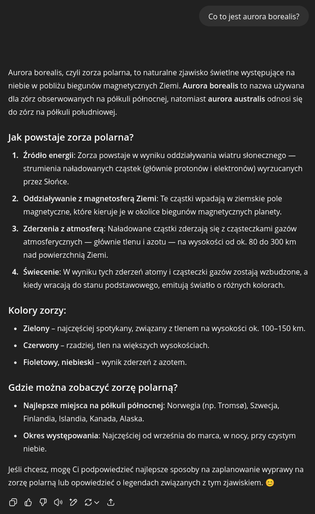
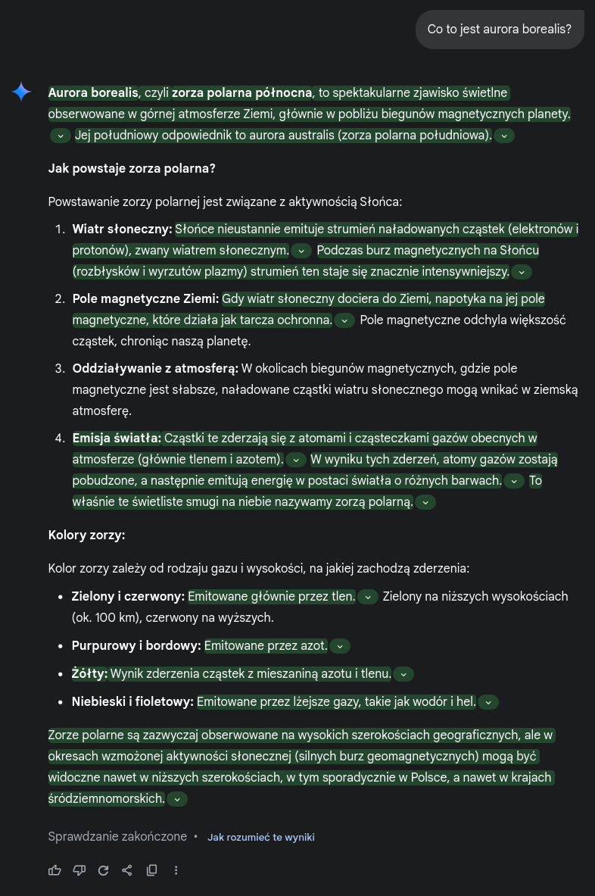
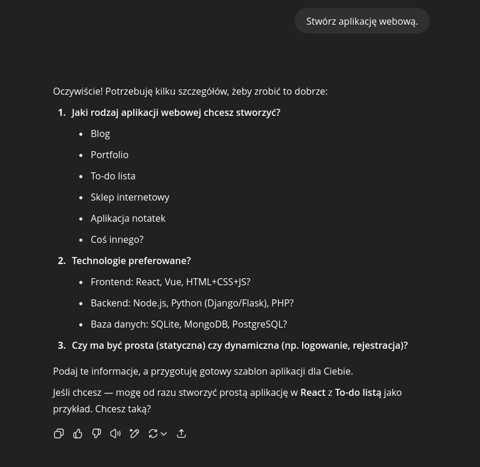
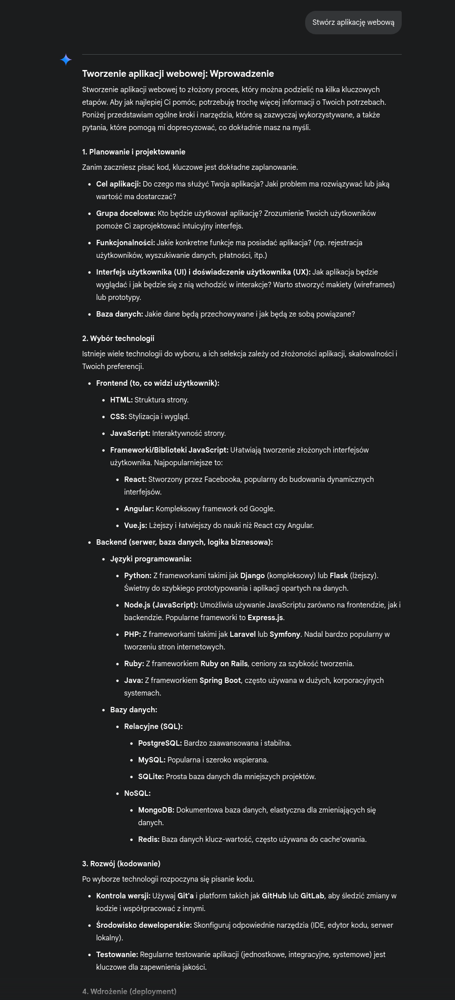

# Na poczatku było słowo...

A podobno Biblia jest przestarzała i niedostosowana do dzisiejszych czasów...
Tymczasem w promptingu (bo tak również nazywane jest tworzenie zapytań), podobnie jak u świętego Jana, wszystko zaczyna się od słowa.
A właściwie słów, bo z jednym słowem to niewiele tu zdziałamy. Ad rem - pierwszym krokiem jest sformułowanie zapytania.

We wprowadzeniu widzieliśmy już przykład zapytania: `Kim jest Scooby-Doo?`. To zapytanie jest proste, ale trafnie sformułowane -
jest konkretne i dość jednoznaczne.

Zapytajmy o coś innego, na przykład `Co to jest aurora borealis?`

ChatGPT o zorzy polarnej

---

Google Gemini o zorzy polarnej

Jak widać, na dość konkretne pytania uzyskamy całkiem konkretne odpowiedzi. \
Gorzej jednak będzie gdy zapytamy o coś niedoprecyzowanego.
Na przykład poprosimy o napisanie aplikacji webowej.

ChatGPT zapytany o stworzenie aplikacji webowej

---

Google Gemini zapytany o stworzenie aplikacji webowej

Jak widać, na niejednoznaczne zadanie model prosi o dostarczenie dodatkowych informacji, aby odpowiedź w ogóle dać jakieś rozwiązanie.
Co w takim przypadku? Przejdźmy do kolejnego rozdziału...