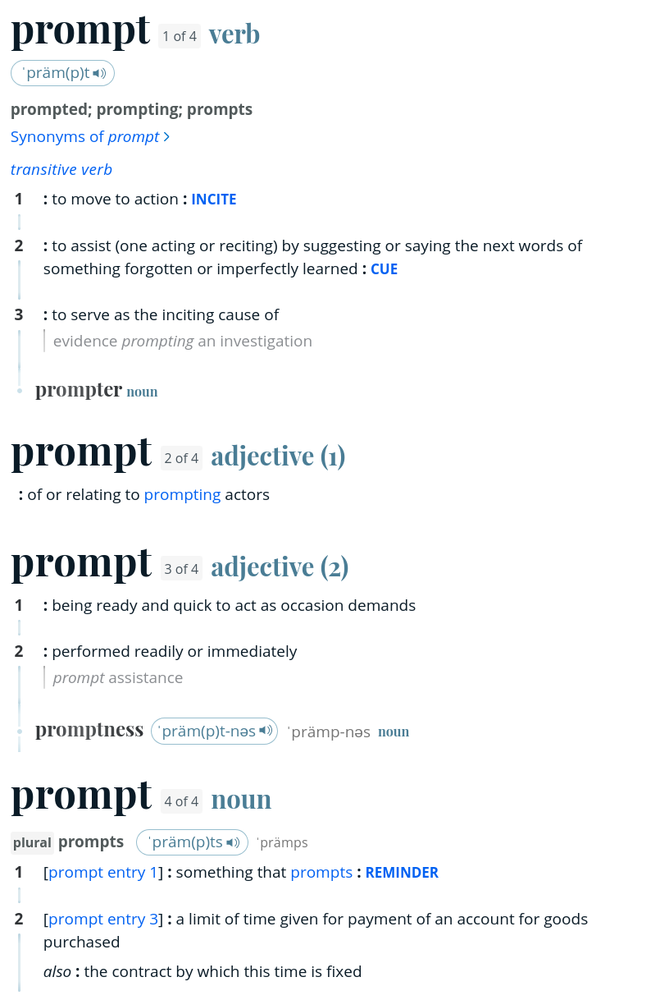
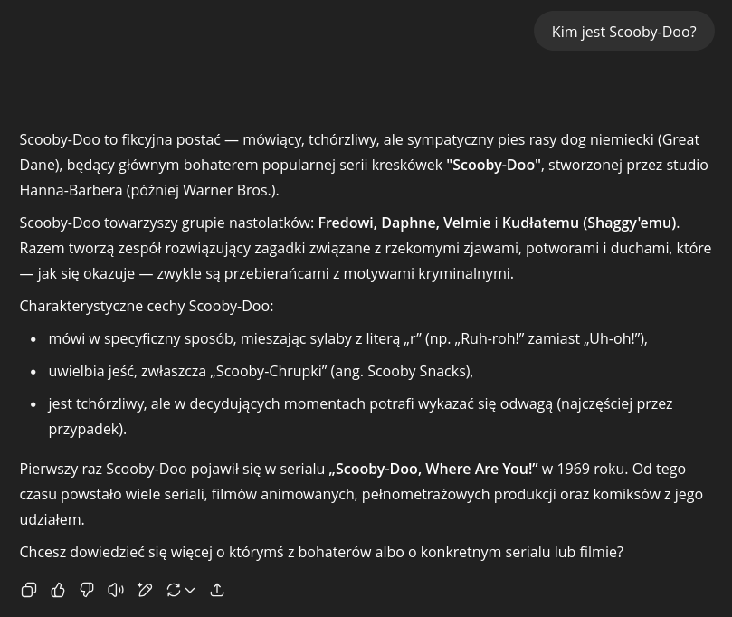
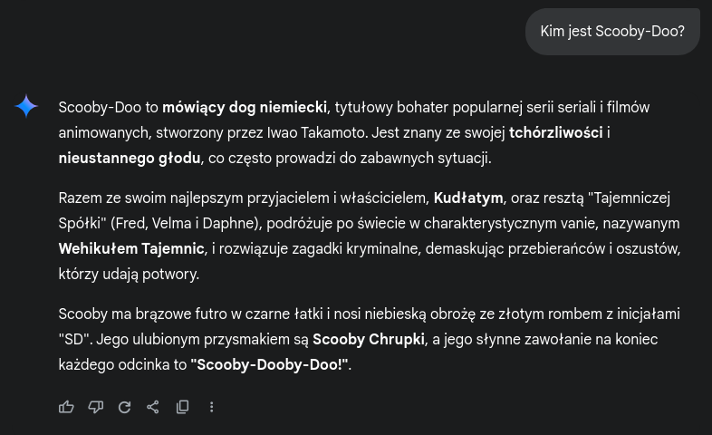

# Prompt

Prompt jaki jest, każdy widzi - można by rzec, parafrazując klasyka - ale żeby nie ruszyć jak Bonaparte na Moskwę przyjrzyjmy się trochę promptowi.

## Krótka historia prompta (promptu?)

Prompt jest pojęciem pochodzącym oczywiście z języka angielskiego i znaczy (za: Merriam-Webster Dictionary):



1. pobudzać do działania
2. pomagać (nakierować) przez podpowiedź
3. być przyczyną jakiegoś działania
4. być gotowym do działania w wypadku zapotrzebowania
5. przypominać o czymś

W kontekście informatycznym korzystamy ze znaczeń 1, 3 i 5, przy czym w kontekście sztucznej inteligencji najbardziej będzie nas interesować znaczenie 3.

W przypadku modeli językowych *prompt* jest zazwyczaj definiowany jako *natural language request* albo *user request* czyli zapytanie użytkownika wyrażone w języku naturalnym. W praktyce efektywne zapytania nie są w pełni naturalne, jednak są na tyle zbliżone do rzeczywistego języka, że można je tak nazwać.

Najprostszym przykładem prompta będzie zwyczajne zapytanie
```plaintext
Jak się nazywasz?
```

Nie da nam ono zbyt wiele (na przykład Gemini odpowiada `Jestem dużym modelem językowym, wytrenowanym przez Google.`) między innymi dlatego, że pytania osobiste nie są specjalnie silną stroną modeli językowych jako że nie mają one osobowości - chociaż przy odpowiednim dostosowaniu potrafią całkiem nieźle udawać człowieka.

Lepszym wyborem będzie zapytanie o jakąś rzecz lub informację, na przykład
```plaintext
Kim jest Scooby-Doo?
```


<span style="display: inline-block; width: 100%; text-align: center; font-style: italic">ChatGPT o Scooby-Doo</p>

---


<span style="display: inline-block; width: 100%; text-align: center; font-style: italic">Google Gemini o Scooby-Doo</span>

Skoro już wiemy czym jest prompt nadszedł czas by dowiedzieć się czym jest prompt engineering, nieprawdaż?